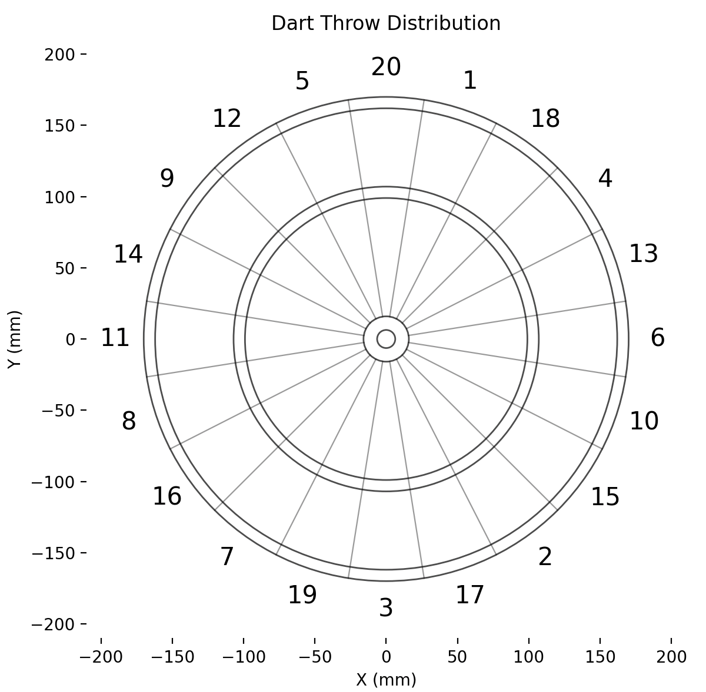
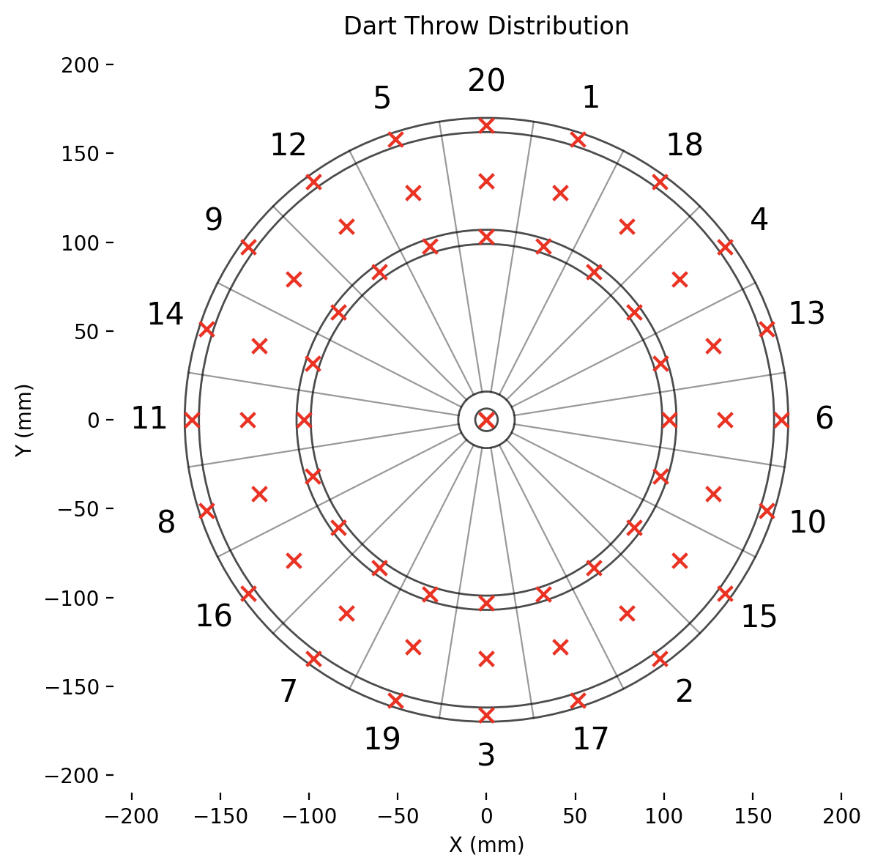
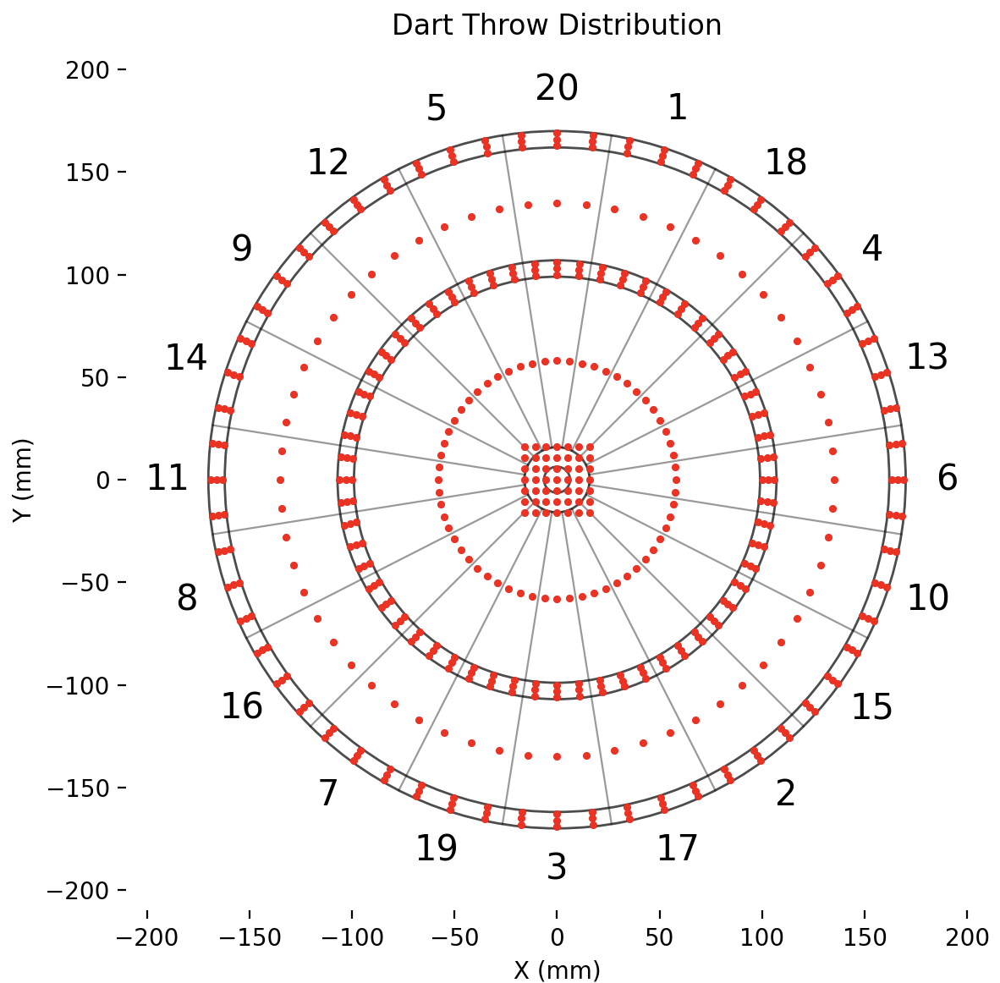
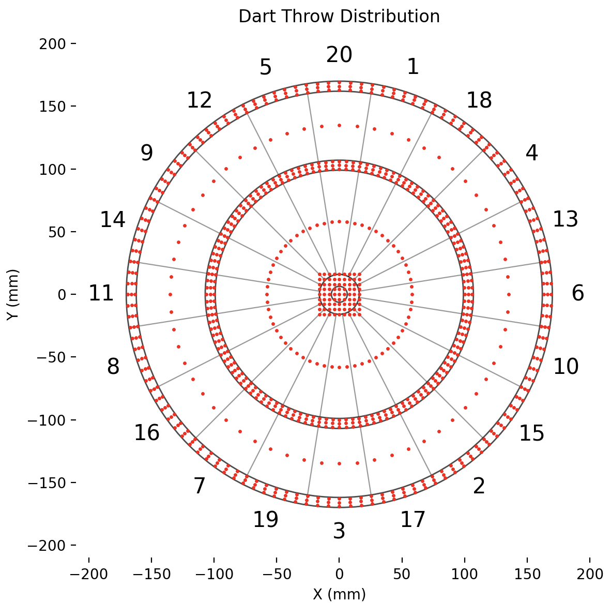
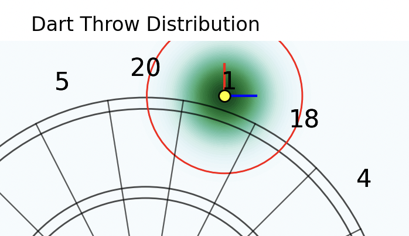
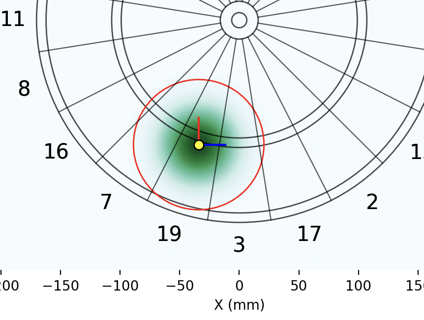
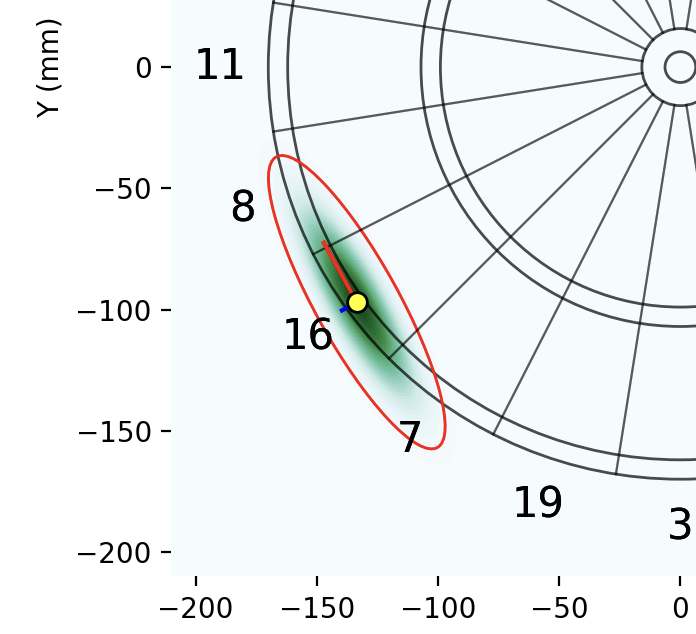

# dart-RL

Code for solving the dart problem using dynamic programming methods.

## Rules



- The dart board is a circle divided into 20 sections. Each section corresponds to a score in 1-20.
    - The sections are numbered in a specific order 6, 13, 4, 18, 1, 20, 5, 12, 9, 14, 11, 8, 16, 7, 19, 3, 17, 2, 15, 10, starting from x = 0 and going clockwise.
    - Each section contains a small triple section and a double section. Hitting these sections will lead to a bonus score.
    - The center of the board contains two sections, the bullseye and the outer bull. Hitting the outer bull will lead to a score of 25, while the bullseye is the double section of the outer bull.
- The player starts with a score of 501 and has to reach a score of 0.
- In each round:
    - The player can throw at most 3 darts in a turn.
    - After 3 darts, the scores are summed and reduced from the initial score.
- Busting and winning
    - If a dart results in a score of 1 or negative score, the turn is invalidated.
    - If a dart results in a score of 0:
        - If the dart is a double, the player wins.
        - Otherwise, the turn is invalidated.
- Assume the landing position of darts follows normal distribution with specified Sigma.

## Launch

Use the following command to run the code:

```bash
python -m dart [args]
```

The following arguments are available:

- `start_score`: The initial score of the player. Default is 501.
- `action_space`: The pattern of simplified action spaces (see below).
- `turns`: The number of darts in one turn. Default is 3.
- Sigma: The covariance matrix of the landing position. Can be specified in the following formats:
    - `Sigma11, Sigma12, Sigma22`: Matrix values
    - `SigmaR1, SigmaR2, SigmaTheta`: Eigenvalues and eigenvectors
    - Sigma should be positive definite.
- `device`: The device to run the code on, can be `cpu`, `cuda` and `mps`. By default, it will use the device that is available.
- `method`: The iteration method, can be `value` for value iteration and `policy` for policy iteration.
- `eps`: The convergence threshold for the value iteration method.
- `discount`: The discount factor.
- `replay`: Whether to simulate a round of game. If set to `true` in the config file, or provided in the command line, a matplotlib figure will be created. Clicking on the figure will show the decision process of the agent.
- `log_level`, `log_file` and `log_format`: The logging level, file and format.

All the arguments can be specified in the command line, or in the config file specified by the `--config` toggle. `configs` directory provides several config demos.

### Action spaces

There are 3 levels of action spaces:

|Level|Positions|#Actions|
|:-:|:-:|:-:|
|`simple`||62|
|`middle`||529|
|`complex`||921|

One can customize action spaces in the config file:

```yaml
action_space:
  - type: 'grid'
    # x_ngrid x y_ngrid targets in a grid
    x_start: -16
    x_end: 16
    x_ngrid: 7
    y_start: -16
    y_end: 16
    y_ngrid: 7
  - type: 'ring'
    # (theta_end - theta_start) / theta_step targets on a ring
    r: [100, 103, 106, 163, 166, 169, 179]
    theta_step: 6
  - type: 'ring'
    r: [58, 135]
    theta_step: 6
  - type: 'dot'
    # A specific point
    x: 170
    y: 170
```

## Interesting Insights

The following phenomenon can be observed under the following action space:

```yaml
action_space:
  - type: 'grid'
    x_start: -16
    x_end: 16
    x_ngrid: 7
    y_start: -16
    y_end: 16
    y_ngrid: 7
  - type: 'ring'
    r: [45, 50, 55, 60, 65, 70, 75, 80, 85, 90, 95, 100, 105, 110, 115, 120]
    theta_step: 6
  - type: 'ring'
    r: [125, 130, 135, 140, 145, 150, 155, 160, 165, 170, 175, 180, 185, 190, 195, 200]
    theta_step: 3
# 2929 actions in total
```

1. When (1) the player have more than one turn left, and (2) the player's Sigma is large, the optimal policy is slightly out of the dart board. This effect is specially dominant when the play have only 2 scores left, since hitting any region other than D1 will lead to bust, which is worse than missing.
  
2. If Sigma is large, the optimal policy is not located in T20, but near T19, T16 and T7. The neighbor region is better than T20 when missing the target region.
  
3. When the eigenvalues of Sigma differ significantly, the agent tends to plan its final double region in a direction parallel to the principal eigenvector of Sigma.
  
4. Occasionally the agent will aim at the bullseye, usually when the score is 125.